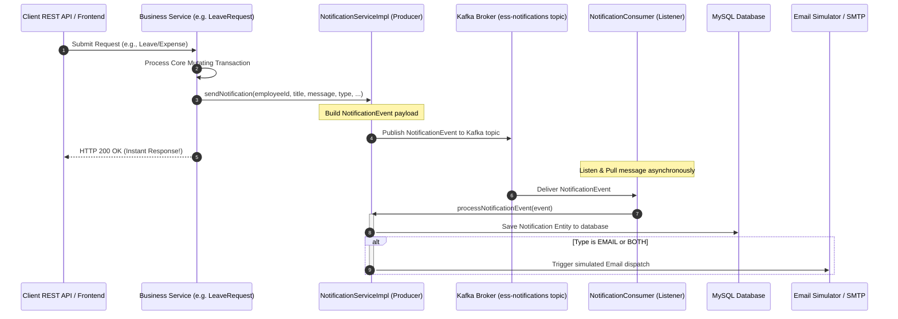

# Apache Kafka Integration for Asynchronous Notifications

This document provides a comprehensive technical guide on the implementation of **Apache Kafka** to decouple the notification system in the **Employee Self Service (ESS) Portal**.

---

## 1. High-Level Architecture Overview

By transitioning from synchronous database writes and external calls to a message-driven architecture, core business transactions (such as submitting a leave request or approving an expense claim) are decoupled from the notification delivery pipeline. 

### Data Flow Diagram



---

## 2. Configuration System

### A. Spring Boot Properties (`application.yml`)
We configured the Kafka properties inside [application.yml](file:///c:/Users/danda/OneDrive/Documents/AntiGravity/ess-project/backend/src/main/resources/application.yml) under the `spring` section:

```yaml
spring:
  kafka:
    bootstrap-servers: localhost:9092
    producer:
      key-serializer: org.apache.kafka.common.serialization.StringSerializer
      value-serializer: org.springframework.kafka.support.serializer.JsonSerializer
      properties:
        max.block.ms: 3000 # Connection timeout threshold (3s) to prevent thread block if Kafka is down
    consumer:
      group-id: ess-notification-group
      auto-offset-reset: earliest
      key-deserializer: org.apache.kafka.common.serialization.StringDeserializer
      value-deserializer: org.springframework.kafka.support.serializer.JsonDeserializer
      properties:
        spring.json.trusted.packages: "com.ess.portal.dto"

# Custom Security and JWT Configurations
app:
  kafka:
    enabled: false # Set to true to route notifications through Kafka (requires running broker)
```

* **`app.kafka.enabled = false` (Default)**: A premium feature introduced to enable seamless offline local development. When set to `false`, the entire Kafka infrastructure is dynamically bypassed, and the application gracefully falls back to immediate synchronous database execution without throwing connection exceptions or connection retry loops. Setting this to `true` activates Kafka event publishing.
* **`max.block.ms = 3000`**: Connection timeout threshold. If the Kafka broker is offline, the producer thread will only block for 3 seconds before timing out, logging a graceful warning, and letting the core business flow proceed uninterrupted.
* **`spring.json.trusted.packages = "com.ess.portal.dto"`**: Enables the consumer's Jackson deserializer to safely deserialize `NotificationEvent` payloads.

### B. Kafka Auto-Topic Setup (`KafkaConfig.java`)
Located at [KafkaConfig.java](file:///c:/Users/danda/OneDrive/Documents/AntiGravity/ess-project/backend/src/main/java/com/ess/portal/config/KafkaConfig.java). We configure the topic configuration to dynamically load only when `app.kafka.enabled` is `true` using conditional boot annotations. This stops the local Spring `AdminClient` from trying to connect to a missing broker:

```java
package com.ess.portal.config;

import org.apache.kafka.clients.admin.NewTopic;
import org.springframework.boot.autoconfigure.condition.ConditionalOnProperty;
import org.springframework.context.annotation.Bean;
import org.springframework.context.annotation.Configuration;
import org.springframework.kafka.config.TopicBuilder;

@Configuration
@ConditionalOnProperty(name = "app.kafka.enabled", havingValue = "true")
public class KafkaConfig {

    public static final String NOTIFICATION_TOPIC = "ess-notifications";

    @Bean
    public NewTopic notificationTopic() {
        return TopicBuilder.name(NOTIFICATION_TOPIC)
                .partitions(1)
                .replicas(1)
                .build();
    }
}
```

---

## 3. Core Codebase Entities & Explanations

### A. The Data Transfer Payload (`NotificationEvent.java`)
Located at [NotificationEvent.java](file:///c:/Users/danda/OneDrive/Documents/AntiGravity/ess-project/backend/src/main/java/com/ess/portal/dto/NotificationEvent.java). A serializable DTO that carries metadata through the Kafka broker:

```java
package com.ess.portal.dto;

import lombok.AllArgsConstructor;
import lombok.Builder;
import lombok.Data;
import lombok.NoArgsConstructor;
import java.io.Serializable;

@Data
@Builder
@NoArgsConstructor
@AllArgsConstructor
public class NotificationEvent implements Serializable {
    private static final long serialVersionUID = 1L;

    private Integer employeeId;
    private String recipientEmail;
    private String title;
    private String message;
    private String type; // e.g., EMAIL, IN_APP, BOTH
    private String referenceType; // e.g., LEAVE, EXPENSE
    private Integer referenceId;
}
```

### B. The Kafka Producer Service (`NotificationProducer.java`)
Located at [NotificationProducer.java](file:///c:/Users/danda/OneDrive/Documents/AntiGravity/ess-project/backend/src/main/java/com/ess/portal/kafka/NotificationProducer.java). It sends events to the Kafka broker asynchronously and contains fallback handling to ensure broker offline conditions do not interrupt core database updates.

```java
package com.ess.portal.kafka;

import com.ess.portal.config.KafkaConfig;
import com.ess.portal.dto.NotificationEvent;
import lombok.extern.slf4j.Slf4j;
import org.springframework.kafka.core.KafkaTemplate;
import org.springframework.stereotype.Service;

@Service
@Slf4j
public class NotificationProducer {

    private final KafkaTemplate<String, NotificationEvent> kafkaTemplate;

    public NotificationProducer(KafkaTemplate<String, NotificationEvent> kafkaTemplate) {
        this.kafkaTemplate = kafkaTemplate;
    }

    public void sendNotificationEvent(NotificationEvent event) {
        log.info("Preparing to publish notification event to Kafka: {}", event);
        try {
            kafkaTemplate.send(KafkaConfig.NOTIFICATION_TOPIC, event)
                .whenComplete((result, ex) -> {
                    if (ex != null) {
                        log.error("Failed to publish notification event to Kafka. Event: {}, Error: {}", event, ex.getMessage(), ex);
                    } else {
                        log.info("Successfully published notification event to Kafka topic [{}] at offset {}",
                                KafkaConfig.NOTIFICATION_TOPIC, result.getRecordMetadata().offset());
                    }
                });
        } catch (Exception e) {
            log.error("Sync block failure publishing notification event to Kafka. Topic connection issue: {}", e.getMessage(), e);
        }
    }
}
```

### C. The Kafka Consumer Service (`NotificationConsumer.java`)
Located at [NotificationConsumer.java](file:///c:/Users/danda/OneDrive/Documents/AntiGravity/ess-project/backend/src/main/java/com/ess/portal/kafka/NotificationConsumer.java). Runs in a managed background thread pool, listening for events on the `ess-notifications` topic:

```java
package com.ess.portal.kafka;

import com.ess.portal.config.KafkaConfig;
import com.ess.portal.dto.NotificationEvent;
import com.ess.portal.service.NotificationService;
import lombok.extern.slf4j.Slf4j;
import org.springframework.kafka.annotation.KafkaListener;
import org.springframework.stereotype.Service;

@Service
@Slf4j
public class NotificationConsumer {

    private final NotificationService notificationService;

    public NotificationConsumer(NotificationService notificationService) {
        this.notificationService = notificationService;
    }

    @KafkaListener(topics = KafkaConfig.NOTIFICATION_TOPIC, groupId = "ess-notification-group")
    public void consumeNotificationEvent(NotificationEvent event) {
        log.info("Received notification event from Kafka topic [{}]: {}", KafkaConfig.NOTIFICATION_TOPIC, event);
        try {
            // Forward event processing to NotificationService for asynchronous save and delivery
            notificationService.processNotificationEvent(event);
            log.info("Finished processing Kafka notification event.");
        } catch (Exception e) {
            log.error("Error processing consumed notification event: {}, error: {}", event, e.getMessage(), e);
        }
    }
}
```

---

## 4. Service Implementations & Pipelines

### A. Refactored `NotificationServiceImpl.java`
Located at [NotificationServiceImpl.java](file:///c:/Users/danda/OneDrive/Documents/AntiGravity/ess-project/backend/src/main/java/com/ess/portal/service/NotificationServiceImpl.java).
We decoupled the service's API into two distinct layers:
1. **Producer Gateway (`sendNotification`)**: Instead of writing to the DB directly, this method acts as a thin client wrapper, turning caller parameters into a `NotificationEvent` and sending it to Kafka.
2. **Asynchronous Processor (`processNotificationEvent`)**: Invoked by the Kafka Consumer thread to write the entity into the MySQL repository and handle email simulation.

```java
    @Override
    public void sendNotification(Integer employeeId, String title, String message, String type, String referenceType, Integer referenceId) {
        NotificationEvent event = NotificationEvent.builder()
                .employeeId(employeeId)
                .title(title)
                .message(message)
                .type(type)
                .referenceType(referenceType)
                .referenceId(referenceId)
                .build();
        notificationProducer.sendNotificationEvent(event);
    }

    @Override
    public void processNotificationEvent(NotificationEvent event) {
        String email = event.getRecipientEmail();
        
        if (email == null && event.getEmployeeId() != null) {
            Employee employee = employeeRepository.findById(event.getEmployeeId())
                    .orElseThrow(() -> new ResourceNotFoundException("Employee not found with id " + event.getEmployeeId()));
            if (employee.getUser() != null && employee.getUser().getEmail() != null) {
                email = employee.getUser().getEmail();
            }
        }

        if (email == null) {
            return;
        }

        Notification notification = new Notification();
        notification.setRecipientEmail(email);
        notification.setTitle(event.getTitle());
        notification.setMessage(event.getMessage());
        notification.setType(event.getType() != null ? event.getType() : "IN_APP");
        notification.setIsRead(false);
        notification.setCreatedBy("SYSTEM");
        notification.setUpdatedBy("SYSTEM");

        notificationRepository.save(notification);

        // Simple simulation of email or push notifications if requested
        if ("EMAIL".equalsIgnoreCase(event.getType()) || "BOTH".equalsIgnoreCase(event.getType())) {
            System.out.println("SIMULATING EMAIL SENT TO: " + email);
            System.out.println("SUBJECT: " + event.getTitle());
            System.out.println("BODY: " + event.getMessage());
        }
    }
```

### B. Refactored `WorkflowEngineServiceImpl.java`
Located at [WorkflowEngineServiceImpl.java](file:///c:/Users/danda/OneDrive/Documents/AntiGravity/ess-project/backend/src/main/java/com/ess/portal/service/WorkflowEngineServiceImpl.java).
Refactored the internal `sendNotification` helper to delegate message delivery to Kafka as a `NotificationEvent` structured with direct email destination routing. This fully integrates core workflows (maker-checker notifications) into the asynchronous broker network:

```java
    private void sendNotification(String email, String title, String msg) {
        NotificationEvent event = NotificationEvent.builder()
                .recipientEmail(email)
                .title(title)
                .message(msg)
                .type("IN_APP")
                .build();
        notificationProducer.sendNotificationEvent(event);
    }
```

---

## 5. Local Setup and Deployment Guide

### Run Kafka Locally with Docker Compose

Create a file named `docker-compose.yml` in your project root or workspace to launch an Apache Kafka Broker + Apache ZooKeeper stack:

```yaml
version: '3.8'

services:
  zookeeper:
    image: confluentinc/cp-zookeeper:7.4.0
    container_name: ess-zookeeper
    environment:
      ZOOKEEPER_CLIENT_PORT: 2181
      ZOOKEEPER_TICK_TIME: 2000
    ports:
      - "2181:2181"

  kafka:
    image: confluentinc/cp-kafka:7.4.0
    container_name: ess-kafka
    depends_on:
      - zookeeper
    ports:
      - "9092:9092"
    environment:
      KAFKA_BROKER_ID: 1
      KAFKA_ZOOKEEPER_CONNECT: zookeeper:2181
      KAFKA_ADVERTISED_LISTENERS: PLAINTEXT://localhost:9092,PLAINTEXT_INTERNAL://kafka:29092
      KAFKA_LISTENER_SECURITY_PROTOCOL_MAP: PLAINTEXT:PLAINTEXT,PLAINTEXT_INTERNAL:PLAINTEXT
      KAFKA_OFF_LEVELS: "INFO"
      KAFKA_INTER_BROKER_LISTENER_NAME: PLAINTEXT_INTERNAL
      KAFKA_OFFSETS_TOPIC_REPLICATION_FACTOR: 1
      KAFKA_TRANSACTION_STATE_LOG_MIN_ISR: 1
      KAFKA_TRANSACTION_STATE_LOG_REPLICATION_FACTOR: 1
```

### Execution Steps

1. **Start the Infrastructure Container**:
   ```bash
   docker-compose up -d
   ```
2. **Start the Spring Boot Application**:
   Use your standard build setup or launch script:
   ```bash
   node start.js
   ```

---

## 6. Verification and Logging Outputs

When a user submits a Leave request, Expense claim, or takes action on a task:
1. **Producer Log**:
   ```
   [Backend] 2026-05-27 05:52:10.123  INFO --- [nio-8080-exec-3] c.e.p.kafka.NotificationProducer         : Preparing to publish notification event to Kafka: NotificationEvent(employeeId=2, recipientEmail=null, title=Pending Approval: LEAVE, message=A new LEAVE request from Jane Doe is pending your approval., type=IN_APP, referenceType=null, referenceId=null)
   [Backend] 2026-05-27 05:52:10.150  INFO --- [nio-8080-exec-3] c.e.p.kafka.NotificationProducer         : Successfully published notification event to Kafka topic [ess-notifications] at offset 12
   ```
2. **Consumer Log**:
   ```
   [Backend] 2026-05-27 05:52:10.155  INFO --- [nt-listener-0-C-1] c.e.p.kafka.NotificationConsumer         : Received notification event from Kafka topic [ess-notifications]: NotificationEvent(employeeId=2, recipientEmail=null, title=Pending Approval: LEAVE, message=A new LEAVE request from Jane Doe is pending your approval., type=IN_APP, referenceType=null, referenceId=null)
   [Backend] 2026-05-27 05:52:10.198  INFO --- [nt-listener-0-C-1] c.e.p.kafka.NotificationConsumer         : Finished processing Kafka notification event.
   ```
