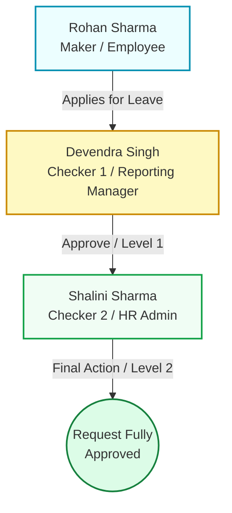
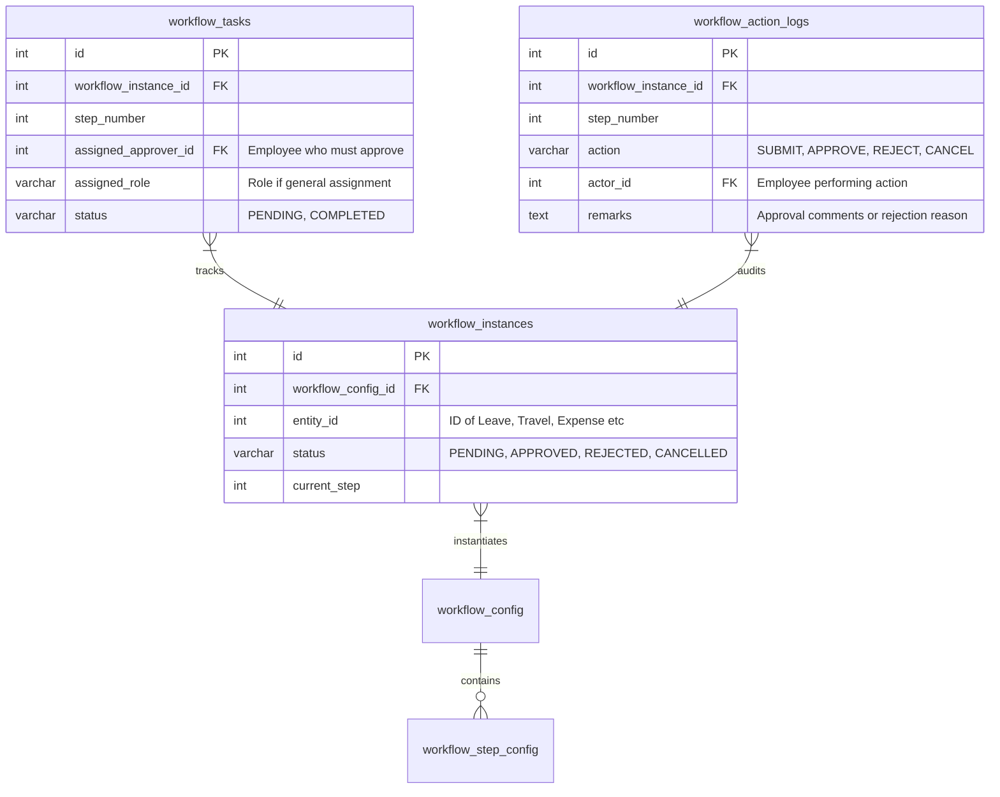

# Architectural Manual - Maker-Checker Workflow Approvals Engine

This manual explains the high-level and low-level architecture of the ESS Portal's Maker-Checker Workflow Approvals Engine. It details how requests (leaves, travel, expense claims, assets, etc.) are initiated, routed, processed, and tracked in the database and frontend.

---

## 1. High-Level Flow (The Workflow Concept)

The ESS Portal operates under a strict **Maker-Checker separation model**. 
- **The Maker**: A standard employee who submits a request (e.g. asking for leave, filing expenses, or requesting a device).
- **The Checker (Approver)**: A supervisor or administrator (e.g. Reporting Manager, HR Admin, Finance Manager, or IT Admin) who reviews the request and either **Approves** or **Rejects** it.
- **The Engine**: The workflow orchestration layer that coordinates state transitions, notifies users, dynamically resolves who the next approver is, and tracks every step in the audit logs.

### Maker-Checker Triplet Example (Testing Flow)
To test the end-to-end routing system, you can use the four configured quick-login roles:

---

## 2. Low-Level Database Schema & Relationships

Every workflow transaction is mapped across four dedicated relational database tables. This decouples individual request entities (such as leaves or travel) from the state machine itself.

### Table Mappings
1. **`workflow_config`**: Catalogs the modules that require approvals (`LEAVE`, `TRAVEL`, `EXPENSE`, `REIMBURSEMENT`, `ASSET`).
2. **`workflow_step_config`**: Contains the levels/steps configured for each config.
   - *Example 1*: `LEAVE` is configured with **1 Step** (`REPORTING_MANAGER`).
   - *Example 2*: `EXPENSE` is configured with **2 Steps** (`REPORTING_MANAGER` $\rightarrow$ `FINANCE_MANAGER`).
3. **`workflow_instances`**: Represents the live execution state machine of a request. It maps a request type and request ID (e.g. `LEAVE` ID `42`) to a workflow status.
4. **`workflow_tasks`**: A pending checklist row in the active approver's inbox queue. The task is created for each active step.
5. **`workflow_action_logs`**: Historical ledger recording every single action performed on the workflow, storing **rejection/approval remarks**, who performed it, and when.

---

## 3. Concrete Module Scenarios & Flows

### Scenario A: Rohan Sharma applies for Leave (1-Step Workflow)
1. **Maker submits**: Rohan Sharma (`rohan.sharma@ess.com`) submits a leave application for 3 days starting June 1st.
   - `leave_requests` entry created with status `PENDING`.
   - `workflow_instances` entry created with status `PENDING` and `current_step = 1`.
   - **Approver Resolved**: The system resolves Rohan’s reporting manager, which is Devendra Singh (`devendra.singh@ess.com`).
   - `workflow_tasks` entry created with status `PENDING` and `assigned_approver_id = 10` (Devendra's ID).
   - `workflow_action_logs` entry created with action `SUBMIT` by Rohan (ID 15).
2. **Pending Table visibility**: Under Rohan's Leaves dashboard, the log displays:
   - **Status**: `PENDING`
   - **Pending With**: `Devendra Singh`
   - **Approver Remarks**: `N/A` (No assessment comments yet).
3. **Checker inbox loading**: Devendra logs in, navigates to **Pending Approvals**, and sees Rohan's Leave request.
4. **Action Processed**: 
   - **If Approved**: Devendra submits the approval.
     - System checks if Step 2 is configured for `LEAVE` (it is not).
     - Workflow instance marked `APPROVED`. Target leave request status marked `APPROVED`.
     - In Rohan’s dashboard, table displays **Pending With**: `APPROVED`, **Remarks**: `"Approved (by Devendra Singh)"`.
   - **If Rejected** (Devendra leaves comment: *"Need project presence"*):
     - Workflow instance marked `REJECTED`. Target leave request status marked `REJECTED`.
     - In Rohan's dashboard, table displays **Pending With**: `REJECTED`, **Remarks**: `"Need project presence (by Devendra Singh)"`.

---

### Scenario B: Rohan Sharma submits an Expense Claim (2-Step Workflow)
1. **Maker submits**: Rohan Sharma submits a claim for ₹5,000 for travel meals.
   - `expense_claims` entry created with status `PENDING`.
   - `workflow_instances` entry created with status `PENDING` and `current_step = 1`.
   - **Level 1 Approver Resolved**: Devendra Singh.
   - `workflow_tasks` entry created for Step 1 assigned to Devendra.
2. **Level 1 Action**: Devendra Singh reviews and clicks **Approve** (comments: *"Meals checked"*).
   - Step 1 task marked `COMPLETED`.
   - System checks `workflow_step_config` $\rightarrow$ Level 2 is configured (`FINANCE_MANAGER`).
   - **Level 2 Approver Resolved**: System queries the database for employees holding the `FINANCE_MANAGER` role, resolving Anil Gupta (`anil.gupta@ess.com`).
   - `workflow_instances` increments `current_step = 2`.
   - New `workflow_tasks` entry created for Step 2 assigned to Anil Gupta (ID 8).
   - Rohan's Expense log displays: **Pending With**: `Anil Gupta`, **Remarks**: `"Meals checked (by Devendra Singh)"`.
3. **Level 2 Action**: Anil Gupta logs in and clicks **Approve** (comments: *"Budget matches structural cap"*).
   - Step 2 task marked `COMPLETED`.
   - No next step configured. Workflow instance marked `APPROVED`. Target expense status marked `APPROVED`.
   - Rohan's Expense log displays: **Pending With**: `APPROVED`, **Remarks**: `"Budget matches structural cap (by Anil Gupta)"`.
